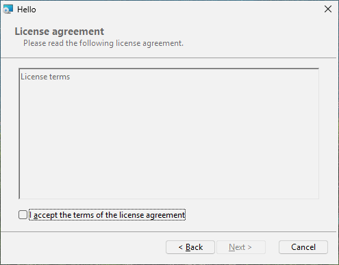
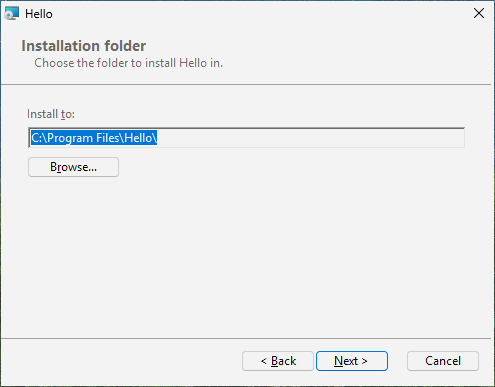
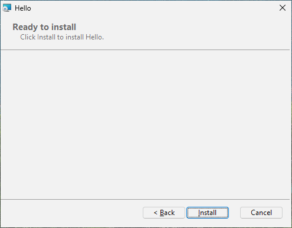
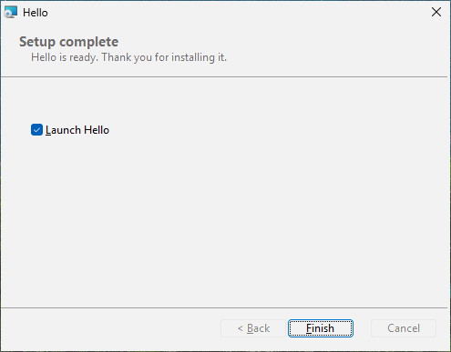
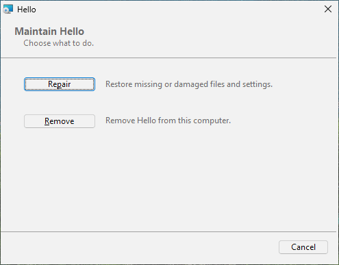

# 대화창, 약관, 그리고 프로그램 시작하기

목표: 페이지가 있는 설치 파일 - 환영, 사용자가 동의해야 하는 약관, 폴더 고르기, 진행, 완료 - 을 만들고, 끝에
Hello 를 시작하겠냐고 묻게 한다.

## 원본

원본 옆에 `LICENSE.txt` 와 `banner.bmp`(약 493 x 58 픽셀 그림)가 있다.

```toml
# tutorial 06: hello.toml
[package]
name = "Hello"
manufacturer = "Example Software"
version = "$(VERSION)"
arch = "x64"
upgrade-code = "{3F2A6C1D-8B4E-4F7A-9C2D-5E6F7A8B9C0D}"
ui = "installdir"
license = "LICENSE.txt"

[define]
VERSION = "1.4.0"

[ui]
banner = "banner.bmp"
launch = "file:Hello"
launch-args = "--first-run"
launch-checked = true

[ui-text.WelcomeText]
text = "This will install [ProductName] [ProductVersion]. Close Hello if it is running."

[ui-text.ExitText]
text = "[ProductName] is ready. Thank you for installing it."

[dir.INSTALLDIR]
path = "ProgramFiles/Hello"

[file.Hello]
dir = "INSTALLDIR"
source = "dist/hello.exe"

[shortcut.StartMenu]
dir = "Programs"
name = "Hello"
target = "file:Hello"
```

## 페이지 세트 고르기: `ui`

`[package]` 의 `ui` 는 내장 대화창 세트 하나를 고른다:

| `ui` | 설치할 때 | 설치 뒤 다시 실행할 때 |
|---|---|---|
| (없음) | Windows Installer 자체의 작은 진행 창만 | 같음 |
| `basic` | 진행, 그다음 완료(또는 오류) | 진행, 완료 |
| `minimal` | 환영, 약관(있으면), 진행, 완료 | 복구 또는 제거 |
| `installdir` | 환영, 약관, 설치 폴더(폴더 찾아보기 포함), 준비, 진행, 완료 | 복구 또는 제거 |
| `features` | `installdir` 과 같고, 기능 트리와 그것이 필요로 하는 디스크 공간이 더해진다(8장) | 복구, 변경, 제거 |

어느 세트에나 무슨 일이 생겼을 때 Windows 가 필요로 하는 페이지도 있다: "정말 취소하겠습니까?", 오류 메시지,
"이 프로그램들이 바꿔야 할 파일을 쓰고 있습니다"(사용 중인 파일), "디스크 공간 부족". 대화창이 있는 패키지도
`/qn` 으로 조용히 설치된다: 모든 페이지는 기본값이 있는 값만 모으기 때문이다.

## 약관: `license`

`license = "LICENSE.txt"` 는 환영 페이지 뒤에 약관 페이지를 더한다. **"I accept the terms of the license
agreement"(사용권 계약에 동의합니다)에 표시하기 전에는 다음 단추가 꺼져 있다.** 파일은:

- `.txt` 또는 `.md` - 평문으로 보인다. 한국어, 다른 글자, 이모지도 그대로다.
- `.rtf` - 글꼴과 서식을 그대로 보인다(워드패드나 Word 로 만든다).

약관 글은 빌드할 때 패키지 안에 저장되므로 사용자에게 그 파일이 필요하지 않다.

## 설치 폴더

`installdir` 이나 `features` 에서는 설치 폴더와, 폴더 찾아보기를 여는 변경 단추가 있는 페이지가 보인다. 사용자가
고른 폴더가 `INSTALLDIR` 이 되고, `INSTALLDIR` 위에 쌓은 dir 은 모두 함께 옮겨 간다. 다른 dir 을 바꾸게 하려면
이름을 댄다: `[ui]` 의 `install-dir = "AppDir"`. 명령줄에서는 폴더를 속성으로 준다:

```text
msiexec /i hello.msi INSTALLDIR="D:\Tools\Hello"
```

## 위쪽의 그림: `banner`

`banner = "banner.bmp"` 는 안쪽 페이지마다 위쪽 띠에 그림을 넣는다(Windows Installer 는 BMP 를 그린다. 약
493 x 58 픽셀). 없으면 띠는 그냥 흰색이다.

## 내 말로: `[ui-text.ID]`

내장 페이지의 모든 글에는 ID 가 있고 `[ui-text.ID]` 가 하나를 바꾼다. ID 목록은 참조 부의
[대화창](../rpk.md#대화창-ui)에 있다. `WelcomeText` 와 `ExitText` 는 첫 페이지와 마지막 페이지의 문장이다. 글은
서식 문자열이다: `[ProductName]`, `[ProductVersion]`, `[Manufacturer]` 는 바뀌고, 대괄호 자체는 `[\[]` 로 쓴다.
단추 글에서 `&` 는 Alt 와 함께 쓰는 글자를 표시한다: `&Next` 는 Alt+N 이다.

## 끝에 프로그램 시작하기: `launch`

`launch = "file:Hello"` 는 완료 페이지에 "Launch Hello"(Hello 실행) 확인란을 넣는다(`launch-checked = false` 가
아니면 표시된 채로). `launch-args` 는 프로그램의 인자다. 표시되어 있으면 마침 단추가 Hello 를 시작한다 - 설치
파일의 관리자 권한이 아니라 설치를 실행한 사용자의 권한으로 - 첫 설치나 업그레이드 뒤에만이고, 복구나 제거
뒤에는 아니며, 조용한 설치에서는 절대 아니다.

## 해 보기

`hello.msi` 를 두 번 누른다: 환영(내 문구와 배너), 약관(확인란을 표시할 때까지 다음이 회색), 설치 폴더, 준비,
진행, "Launch Hello" 가 표시된 완료. 설치한 뒤 다시 실행하면 복구와 제거를 권하는 페이지가 나온다.

![환영: `[ui-text.WelcomeText]` 의 글](../images/ch06-welcome.png)











이 장의 원본에는 한국어가 없으므로 페이지는 영어다. 한국어 페이지는 7장에서 더한다.

## 안에서 무슨 일이 일어났나

대화창이 있는 패키지는 그것을 표로 지닌다 - `Dialog`, `Control`, `ControlEvent` 등 - 이 표들이 모든 창, 단추,
글 상자를 위치와 눌렀을 때 일어나는 일과 함께 기술한다. rubrapack 은 내장 세트에서 이것을 쓴다:

```text
C:\work\hello> rubrapack inspect hello.msi Dialog
...
RpBrowseDlg RpCancelDlg RpErrorDlg RpExitDlg RpFatalDlg RpInstallDirDlg RpLicenseDlg
RpMaintenanceDlg RpOutOfDiskDlg RpProgressDlg RpReadyDlg RpUserExitDlg RpWelcomeDlg FilesInUse
```

(여기서는 첫 열만 보였다.) `InstallUISequence` 표는 페이지가 언제 나오는지 말한다:

```text
RpWelcomeDlg	NOT Installed	1230
RpMaintenanceDlg	Installed AND NOT RESUME AND NOT Preselected	1240
RpProgressDlg		1280
RpExitDlg		-1
RpUserExitDlg		-2
RpFatalDlg		-3
```

가운데 열은 *조건*이다: 환영 페이지는 제품이 아직 설치되지 않았을 때만, 유지 관리 페이지는 설치되어 있을 때
나온다. 음수는 특별하다: 성공한 끝(-1), 사용자가 취소한 끝(-2), 실패한 끝(-3)에 보이는 페이지다. 9장에서 내
조건을 쓴다.
