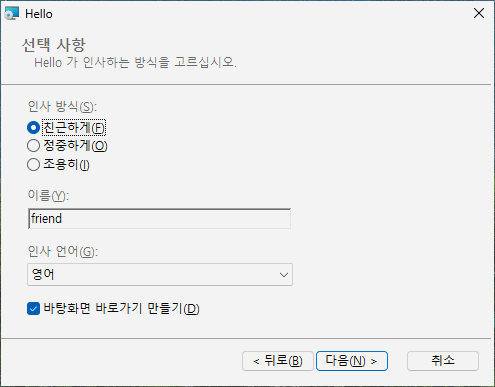

# 나만의 대화창 페이지

목표: 설치 폴더 페이지 뒤에 "선택 사항" 페이지를 더한다. 사용자는 거기서 인사 방식을 고르고, 이름을 입력하고,
목록에서 언어를 고르고, 바탕화면 바로가기를 만들지 정한다. 그리고 그 답을 레지스트리에 저장한다.

## 원본

```toml
# tutorial 14: hello.toml
format = 1

[package]
name = "Hello"
manufacturer = "Example Software"
version = "$(VERSION)"
arch = "x64"
upgrade-code = "{3F2A6C1D-8B4E-4F7A-9C2D-5E6F7A8B9C0D}"
ui = "installdir"

[define]
VERSION = "1.12.0"

[ui]
languages = ["ko"]

[dialog.Options]
after = "RpInstallDirDlg"
title = "Options"
title-ko = "선택 사항"
description = "Choose how Hello greets you."
description-ko = "Hello 가 인사하는 방식을 고르십시오."

[dialog-control.ModeLabel]
dialog = "Options"
type = "text"
x = 20
y = 55
width = 330
height = 12
text = "Greeting &style:"
text-ko = "인사 방식(&S):"

[dialog-control.Mode]
dialog = "Options"
type = "radio"
x = 20
y = 70
width = 200
height = 42
property = "GREETING_STYLE"
values = ["friendly", "formal", "silent"]
labels = ["&Friendly", "F&ormal", "S&ilent"]
labels-ko = ["친근하게(&F)", "정중하게(&O)", "조용히(&I)"]

[dialog-control.NameLabel]
dialog = "Options"
type = "text"
x = 20
y = 122
width = 330
height = 12
text = "&Your name:"
text-ko = "이름(&Y):"

[dialog-control.Name]
dialog = "Options"
type = "edit"
x = 20
y = 136
width = 200
height = 18
property = "GREETING_NAME"

[dialog-control.LanguageLabel]
dialog = "Options"
type = "text"
x = 20
y = 164
width = 330
height = 12
text = "&Greeting language:"
text-ko = "인사 언어(&G):"

[dialog-control.Language]
dialog = "Options"
type = "combo"
x = 20
y = 178
width = 200
height = 16
property = "GREETING_LANGUAGE"
values = ["en", "ko"]
labels = ["English", "Korean"]
labels-ko = ["영어", "한국어"]

[dialog-control.DesktopBox]
dialog = "Options"
type = "checkbox"
x = 20
y = 204
width = 330
height = 16
property = "DESKTOP_SHORTCUT"
text = "Create a &desktop shortcut"
text-ko = "바탕화면 바로가기 만들기(&D)"

[property.GREETING_STYLE]
value = "friendly"

[property.GREETING_NAME]
value = "friend"

[property.GREETING_LANGUAGE]
value = "en"

[property.DESKTOP_SHORTCUT]
value = "1"

[dir.INSTALLDIR]
path = "$(ProgramFiles)/Hello"

[file.Hello]
dir = "INSTALLDIR"
source = "dist/hello.exe"

[registry.StyleValue]
root = "HKLM"
key = 'SOFTWARE\Example Software\Hello'
name = "Style"
value = "[GREETING_STYLE]"

[registry.NameValue]
root = "HKLM"
key = 'SOFTWARE\Example Software\Hello'
name = "Name"
value = "[GREETING_NAME]"

[registry.LanguageValue]
root = "HKLM"
key = 'SOFTWARE\Example Software\Hello'
name = "Language"
value = "[GREETING_LANGUAGE]"

[shortcut.StartMenu]
dir = "Programs"
name = "Hello"
target = "file:Hello"

[shortcut.Desktop]
dir = "Desktop"
name = "Hello"
target = "file:Hello"
when = "DESKTOP_SHORTCUT"
```

## 페이지: `[dialog.ID]`

| 키 | 뜻 |
|---|---|
| `after` | 이 페이지가 뒤따를 페이지: `RpWelcomeDlg`, `RpLicenseDlg`(약관이 있을 때), `RpInstallDirDlg`(`installdir`, `features`), `RpCustomizeDlg`(`features`), 또는 내가 만든 다른 페이지 |
| `title`, `description` | 배너의 제목과 그 아래 한 줄(제목 기본값: 제품 이름) |
| `title-xx`, `description-xx` | `[ui] languages` 의 다른 언어로 쓴 같은 것 |

페이지는 내장 페이지와 같은 배너와 뒤로 / 다음 / 취소 단추를 받고, 본문은 내가 채운다. 같은 페이지 뒤에 오는
페이지가 여럿이면 ID 순서로 온다. `minimal` 에서는 마지막 페이지의 단추가 "설치"가 되고, 다른 세트에서는 늘
"준비" 페이지가 마지막에 온다. 페이지는 `minimal`, `installdir`, `features` 에서 쓸 수 있다.

## 페이지 위의 자리

위치와 크기는 픽셀이 아니라 *대화창 단위*다. Windows 가 글꼴에 맞춰 늘이고 줄이므로, 페이지는 어느 화면
크기에서도 같게 보인다. 모든 페이지는 370 x 270 단위다:

```text
 x=0                                                         x=370
 +--------------------------------------------------------------+ y=0
 | Title (banner)                                               |
 | Description                                                  |
 +--------------------------------------------------------------+ y=44
 |                                                              | y=45
 |   your controls go here: x from 0 to 370, y from 45 to 234   |
 |                                                              |
 +--------------------------------------------------------------+ y=234
 |                          [ < Back ] [ Next > ]   [ Cancel ]  | y=243
 +--------------------------------------------------------------+ y=270
```

그림의 이름은 틀의 컨트롤 ID 그대로다: `Title` 은 제목, `Description` 은 설명, `Back` / `Next` / `Cancel` 은
뒤로 / 다음 / 취소 단추다.

Tab 키는 내 컨트롤을 위에서 아래로, 그다음 왼쪽에서 오른쪽으로 옮겨 다닌다.

## 컨트롤: `[dialog-control.ID]`

컨트롤마다 자기 `dialog`, `type`, 그리고 `x`, `y`, `width`, `height` 를 적는다:

| `type` | 보이는 것 | 속성 |
|---|---|---|
| `text` | 글자(`text`) | - |
| `checkbox` | 글자가 붙은 확인란 | 표시하면 `1`, 표시를 지우면 속성이 없어진다 |
| `edit` | 입력하는 한 줄 칸 | 입력한 글 |
| `radio` | 값마다 단추 하나, 그중 하나를 고름 | `values` 중 하나 |
| `combo` | 펼쳐지는 목록 | `values` 중 하나 |

- `values`(문자열 1~32개)는 속성이 받는 값이고, `labels` 는 사용자가 보는 글로 같은 순서다(기본값: 값 그대로).
  `labels-xx` 와 `text-xx` 가 번역이다.
- 라디오 묶음은 값 하나에 높이 12단위쯤이 필요하다.
- 글자 안의 `&` 는 Alt 키를 표시한다: `edit` 앞의 `text` 에 두면 Alt+Y 가 그 입력 칸으로 뛴다. 한국어 글에서는
  `이름(&Y):` 처럼 괄호 안에 쓰는 것이 Windows 의 관례다.
- 컨트롤 ID `Banner`, `Title`, `Description`, `BannerLine`, `BottomLine`, `Back`, `Next`, `Cancel` 은 틀의
  것이고, `Rp` 로 시작하는 페이지 ID 는 rubrapack 의 것이다. 한 페이지에 컨트롤은 64개까지다.

## 모든 값에는 기본값이 있어야 한다: `[property.NAME]`

대화창은 값을 *모을* 뿐이다. 조용한 설치(`/qn`)는 페이지를 하나도 보이지 않고 속성을 있는 그대로 쓴다. 그래서
컨트롤이 정하는 속성마다 기본값을 담은 `[property.*]` 가 있고, `radio` 와 `combo` 의 기본값은 `values` 중
하나여야 한다. 같은 속성은 명령줄에서도 줄 수 있다:

```text
msiexec /i hello.msi /qn GREETING_STYLE=formal GREETING_NAME=Ada DESKTOP_SHORTCUT=""
```

rubrapack 은 내 컨트롤의 속성을 스스로 보안 속성으로 만들어, 설치의 관리자 권한 부분까지 전해지게 한다:
`[registry.StyleValue]` 가 `[GREETING_STYLE]` 을 쓰고, 바탕화면 바로가기의 `when = "DESKTOP_SHORTCUT"` 이
확인란을 본다.

## 해 보기

설치한다: 폴더 페이지 뒤에 내 컨트롤이 든 "Options" 가 온다. 뒤로는 폴더 페이지로, 다음은 "준비"로 간다. 언어
페이지에서 한국어를 고르면 페이지 제목과 글자가 한국어("선택 사항")다. 설치한 뒤 `regedit` 을 열면
`HKLM\SOFTWARE\Example Software\Hello` 아래에 `Style`, `Name`, `Language` 가 있다. 바탕화면 바로가기는 확인란을
표시했을 때만 있다.



## 안에서 무슨 일이 일어났나

페이지는 `Control` 표의 행들 - 틀의 것과 내 것 - 이고, 단추는 `ControlEvent` 의 행들이다:

```text
C:\work\hello> rubrapack inspect hello.msi ControlEvent
...
RpInstallDirDlg	Next	NewDialog	Options	1	1
Options	Back	NewDialog	RpInstallDirDlg	1	1
Options	Next	NewDialog	RpReadyDlg	1	1
RpReadyDlg	Back	NewDialog	Options	1	1
...
```

"폴더 페이지에서 다음을 누르면 Options 를 보여라". Options 의 뒤로와 다음은 이웃 페이지로 이어진다. rubrapack 은
내 페이지가 들어가도록 내장 페이지들의 연결을 바꾼다. `Control` 표의 속성 수는 여기서도 비트 플래그다(1 보임,
2 사용 가능, 65536 투명, ...).
