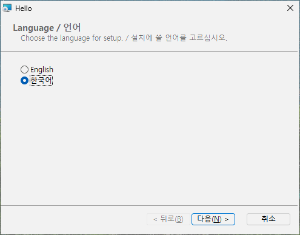

# Several languages

Goal: one package whose pages speak English or Korean, with a license in each language, Korean
chosen in advance on Korean Windows.

## The source

`LICENSE-ko.txt`, the Korean license, is next to `LICENSE.txt`.

```toml
# tutorial 07: hello.toml
[package]
name = "Hello"
manufacturer = "Example Software"
version = "$(VERSION)"
arch = "x64"
upgrade-code = "{3F2A6C1D-8B4E-4F7A-9C2D-5E6F7A8B9C0D}"
ui = "installdir"
license = "LICENSE.txt"
downgrade-message = "A newer Hello is already installed."

[define]
VERSION = "1.5.0"

[ui]
languages = ["ko"]
license-ko = "LICENSE-ko.txt"
launch = "file:Hello"

[ui-text.WelcomeText]
text = "This will install [ProductName] [ProductVersion]."
text-ko = "[ProductName] [ProductVersion]을(를) 설치합니다."

[dir.INSTALLDIR]
path = "ProgramFiles/Hello"

[file.Hello]
dir = "INSTALLDIR"
source = "dist/hello.exe"

[shortcut.StartMenu]
dir = "Programs"
name = "Hello"
target = "file:Hello"
```

## Adding a language: `languages`

The pages are always in English. `languages = ["ko"]` in `[ui]` adds Korean to the same package,
and then:

- the first page asks which language to use - English or 한국어;
- on a Windows whose regional format (or, failing that, system language) is Korean, 한국어 is
  already selected; elsewhere English;
- every page after it - welcome, license, folder, ready, progress, finished, and the cancel,
  error, files-in-use, disk-space and maintenance pages - speaks the language chosen.

With English alone there is no language page. A silent installation (`/qn`) shows no pages and needs no choice. `RPLANGUAGE=ko` on the command line picks Korean in advance - on the language page, which still comes first, and for a silent installation:

```text
msiexec /i hello.msi RPLANGUAGE=ko
```



## A license per language: `license-xx`

`license-ko = "LICENSE-ko.txt"` is the license shown when Korean is chosen; English (and any added
language without its own) shows `[package] license`. The same `.txt` / `.md` / `.rtf` rules apply.

## A text per language: `text-xx`

In `[ui-text.ID]`, `text` is the text for every language and `text-ko` the Korean one. Every
built-in text already exists in English and Korean; give `text-ko` only where you give `text`, so
both languages say the same thing.

## Languages other than English and Korean

rubrapack's built-in pages are written in English and Korean. For another language - `ja`, `de`,
`fr`, ... - you provide every text as `text-xx` yourself; the build lists the ones missing:

```text
hello.toml:16:1: error[RP1202]: language 'ja' has no built-in texts: give [ui-text.ID] text-ja for all of them (64 missing, the first is Back)
```

For such a language, three more keys in `[ui]` may help: `name-ja` (its name on the language
page), `font-ja` (the typeface of its pages) and `langid-ja` (the Windows language numbers that
select it in advance - one number or a list). For common languages (`ja`, `zh`, `de`, `fr`, `es`,
`it`, `pt`, `nl`, `pl`, `ru`, `uk`, `tr`, `vi`, `th`) these three are built in. Korean pages use
the Malgun Gothic typeface, English ones Segoe UI.

## What is not translated

- Windows Installer's own words - the sizes and the menu in the feature tree, "time remaining",
  its error messages - come from Windows, not from the package.
- The downgrade message (chapter 3) and the removal message of `refuse-upgrade-below` are one text
  each; write them in both languages if you need both ("A newer Hello is already installed. / 더
  새 Hello 가 설치되어 있습니다.").
- `[package] language = "ko-KR"` only sets the package's own language code; it does not make the
  pages Korean - `languages` does.

## Try it

On a Korean Windows, double-click `hello.msi`: the language page has 한국어 selected; every page
after it is Korean, with the Korean license. Choose English: the same pages in English with
`LICENSE.txt`. Try `msiexec /i hello.msi RPLANGUAGE=ko` on an English Windows.

![The welcome page with English chosen: the text of `[ui-text.WelcomeText]`](../images/ch07-welcome.png)

## What happened inside

A Windows Installer package has no built-in notion of "several languages": each text on a page is
fixed in its table. rubrapack therefore makes every text a *property* - a named value - and shows
the property on the page:

```text
C:\work\hello> rubrapack inspect hello.msi Property
...
RpT_WelcomeText	This will install Hello 1.5.0.
RpT_WelcomeText_en	This will install Hello 1.5.0.
RpT_WelcomeText_ko	Hello 1.5.0을(를) 설치합니다.
...
```

Before the first page, small actions copy the chosen language's texts into the shown properties;
each runs only when its condition is true:

```text
C:\work\hello> rubrapack inspect hello.msi InstallUISequence
...
RpL_ko_26	RPLANGUAGE = "ko"	127
...
C:\work\hello> rubrapack inspect hello.msi CustomAction
...
RpL_ko_26	51	RpT_WelcomeText	[RpT_WelcomeText_ko]
```

Type 51 is "set a property": `RpT_WelcomeText` becomes the value of `RpT_WelcomeText_ko`. The text is
stored as UTF-8 in the package (code page 65001); [Text](../basics/03-text.md) in Part III explains text encodings, and [the MSI database](../formats/msi-database.md) in Part IV how the strings are stored.
