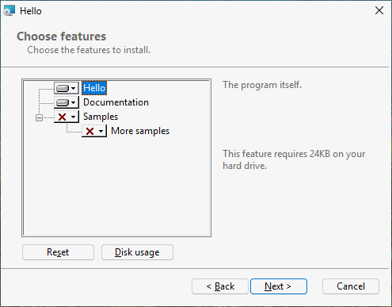

# Optional parts: features and the user's choices

Goal: let the user choose what to install. The program itself is always installed; the
documentation is offered and ticked; the samples are offered but not ticked; a diagnostics part
is hidden and installed only on request.

## Features

A *feature* is a part of the product the user can choose: a line in the installer's tree with a
title, a description and a tick. Every file belongs to exactly one feature; a feature holds as many
files as you like.

## The source

```toml
# tutorial 08: hello.toml
format = 1

[package]
name = "Hello"
manufacturer = "Example Software"
version = "$(VERSION)"
arch = "x64"
upgrade-code = "{3F2A6C1D-8B4E-4F7A-9C2D-5E6F7A8B9C0D}"
ui = "features"
license = "LICENSE.txt"

[define]
VERSION = "1.6.0"

[feature.Main]
title = "Hello"
description = "The program itself."
required = true

[feature.Documentation]
title = "Documentation"
description = "The guide, in the docs folder."

[feature.Samples]
title = "Samples"
description = "Example files to try Hello with."
level = 2

[feature.MoreSamples]
title = "More samples"
description = "Samples in sub folders."
parent = "Samples"
follow-parent = true

[feature.Diagnostics]
title = "Diagnostics"
hidden = true
level = 3

[dir.INSTALLDIR]
path = "$(ProgramFiles)/Hello"
feature = "Main"

[dir.DocsDir]
path = "$(INSTALLDIR)/docs"
feature = "Documentation"

[dir.SamplesDir]
path = "$(INSTALLDIR)/samples"
feature = "Samples"

[dir.MoreSamplesDir]
path = "$(INSTALLDIR)/samples/sub"
feature = "MoreSamples"

[file.Hello]
dir = "INSTALLDIR"
source = "dist/hello.exe"

[files.DocFiles]
dir = "DocsDir"
glob = "dist/docs/**"

[files.SampleFiles]
dir = "SamplesDir"
glob = "dist/samples/*.txt"

[files.MoreSampleFiles]
dir = "MoreSamplesDir"
glob = "dist/samples/sub/*.txt"

[file.Readme]
dir = "INSTALLDIR"
source = "dist/readme.txt"
feature = "Diagnostics"

[shortcut.StartMenu]
dir = "Programs"
name = "Hello"
target = "file:Hello"
```

## Declaring features: `[feature.ID]`

| Key | Meaning |
|---|---|
| `title` | the line in the tree |
| `description` | the text shown when the line is selected |
| `level` | 1 (default): installed by default. 2 or more: offered, but only installed when chosen |
| `required = true` | always installed: the tree does not offer "will be unavailable" for it |
| `parent = "Samples"` | a line under another feature in the tree |
| `follow-parent = true` | installed exactly when its parent is |
| `hidden = true` | not shown in the tree at all |

Feature IDs share one name space with dirs and files: `Documentation` the feature and `DocsDir`
the folder must have different IDs (rubrapack says so with `RP1301` otherwise).

## Putting files in features: `feature`

- On a dir: every file in that folder belongs to the feature - `DocsDir` puts `guide.txt` in
  `Documentation`, `SamplesDir` puts `sample1.txt` in `Samples`.
- On a file or a file group: that file (or group) belongs to it, whatever its folder - `Readme`
  is in `INSTALLDIR`, a folder of `Main`, but belongs to `Diagnostics`.

A dir does not pass its feature on to the dirs below it: `MoreSamplesDir` names its own. As soon as
the source declares one feature, **everything installed needs one**; rubrapack stops with `RP1202`
naming what has none.

## What the user sees

With `ui = "features"`, after the license and the install folder comes "Choose features": a tree

```text
[x] Hello                     (cannot be turned off)
[x] Documentation
[ ] Samples
      [ ] More samples        (follows Samples)
```

Each line has a menu: "Will be installed on local hard drive", "Entire feature will be installed on
local hard drive", "Entire feature will be unavailable". Selecting a line shows its description and
the disk space it needs; "Disk Usage" shows the space on every drive. (These texts come from Windows
and stay English.) Diagnostics does not appear.

A default installation (double-click, Next, Next, ...) installs Hello and the documentation.



## Choosing from the command line

Features are chosen with properties, so a silent installation can choose too:

| Command | Installs |
|---|---|
| `msiexec /i hello.msi /qn` | the defaults: Main, Documentation |
| `msiexec /i hello.msi /qn ADDLOCAL=Samples` | the defaults and the samples (with More samples, which follows) |
| `msiexec /i hello.msi /qn ADDLOCAL=ALL` | every feature, hidden ones included |
| `msiexec /i hello.msi /qn INSTALLLEVEL=3` | every feature whose level is 3 or less: all of these |
| `msiexec /i hello.msi /qn REMOVE=Documentation` | the defaults without the documentation |

Feature IDs are case-sensitive and separated by commas: `ADDLOCAL=Samples,Diagnostics`.
`required` only binds the tree: `REMOVE=Main` on the command line is still obeyed (that is how
Windows Installer works).

## Changing the choice later

After installation, Installed apps offers Modify for Hello; it opens the installer's maintenance
page with **Change**, **Repair** and **Remove**. Change shows the same tree with what is installed
ticked; the user adds or removes parts. From the command line on an installed product:

```text
msiexec /i hello.msi ADDLOCAL=Samples
msiexec /i hello.msi REMOVE=Samples
```

## What happened inside

```text
C:\work\hello> rubrapack inspect hello.msi Feature
Feature	Feature_Parent	Title	Description	Display	Level	Directory_	Attributes
...
Diagnostics		Diagnostics		0	3		0
Documentation		Documentation	The guide, in the docs folder.	3	1		0
Main		Hello	The program itself.	1	1		16
MoreSamples	Samples	More samples	Samples in sub folders.	7	1		2
Samples		Samples	Example files to try Hello with.	5	2		0
```

- `Display` orders the tree (odd numbers, in the order of the source); 0 hides the feature.
- `Level` is the level; Windows installs a feature by default when its level is not above the
  property `INSTALLLEVEL`, which is 1.
- `Attributes` are bit flags: 16 means "may not be made absent" (`required`), 2 "follow the
  parent".

The `FeatureComponents` table ties each component - each file - to its feature:

```text
C:\work\hello> rubrapack inspect hello.msi FeatureComponents
...
Documentation	C_a10be66379e69940a2e0
Main	C_185f8db32271fe25f561
Samples	C_a5674982edf0797da30f
...
```
